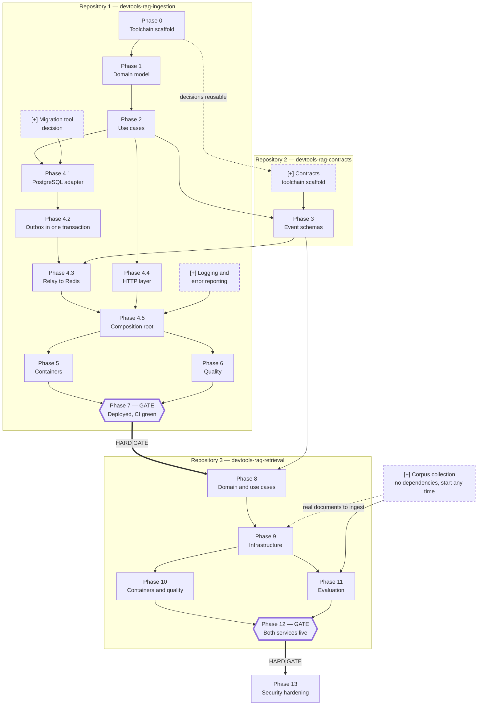

# Build Plan — What to Build, In What Order, and What Can Run in Parallel

> **What this file is for.** `docs/ROADMAP.md` lists the units of work for this
> repository. `docs/ARCHITECTURE.md` section 5 lists the phases for the whole
> system. Neither shows which pieces *block* which, or which could be worked on
> at the same time. This file does, for all three repositories at once.
>
> **This file is living.** When work appears that this analysis missed, it is
> added here rather than tracked somewhere else. Items added after the original
> roadmap are marked `[+]` in the diagram and listed in
> [Work added to the plan](#work-added-to-the-plan).

---

## The map

### How to read it

| Marking | Meaning |
|---|---|
| Solid arrow `→` | The task at the tail **must finish** before the one at the head starts |
| Dotted arrow `⇢` | Helpful but not blocking — the later task is better with it, and possible without |
| Thick arrow with **HARD GATE** | Nothing downstream begins until everything upstream is finished and deployed |
| Six-sided box | A gate: a checkpoint, not a task |
| `[+]` and a dashed border | Work this plan added; it was not in the original roadmap |
| Box grouping | Which of the three repositories the work lives in |

Anything with **no arrow between it** can be worked on at the same time.

---

## What can be done in parallel

Five genuine opportunities. Everything else is a chain.

| These can run at the same time | Why they do not block each other |
|---|---|
| **Corpus collection** and **everything else** | Gathering the documents needs no code at all. It can start today and must be finished before Phase 11. |
| **Contracts scaffold** and **Phases 1–2** | Setting up the second repository's tooling reuses the decisions already recorded in `docs/adr/`. It needs no ingestion code. |
| **Phase 4.4 (HTTP layer)** and **Phases 4.1 → 4.2 → 4.3 (database and relay)** | The web layer talks only to the use cases from Phase 2. The storage chain talks only to the database. They meet for the first time at 4.5. |
| **Phase 5 (containers)** and **Phase 6 (quality)** | The integration tests start their own throwaway containers; they do not need the production image to exist. |
| **Phase 11 (evaluation)** and **Phase 10 (containers and quality)** | Measuring answer quality needs a working query path from Phase 9, not a packaged image. |

## What blocks the most

| Task | Why it is the bottleneck |
|---|---|
| **Phase 2 — Use cases** | Four separate lines of work wait on it: the contracts, the database adapter, the HTTP layer, and eventually the second service. |
| **Phase 7 — Deployment gate** | Nothing in the retrieval service may begin until this is done. This is deliberate. |
| **Phase 3 — Event schemas** | Both services depend on it, and it cannot be designed before Phase 2 without guessing. |
| **Phase 9 — Retrieval infrastructure** | Both remaining pieces of the second service wait on it. |

---

## What each box means, in plain language

### Ingestion service

**Phase 0 — Toolchain scaffold.** Set up the workshop before making anything. This means choosing the tools that check the work — one that catches sloppy writing, one that catches mistakes about what kind of thing each value is, one that runs the tests — and proving all three run and pass on an empty project. It is done first because these tools are painless to adopt when there is nothing to fix and painful to adopt later.

**Phase 1 — Domain model.** Write down, in code, what a document and a collection actually *are*, and the rules they must always obey: two identical documents cannot be stored twice in the same collection, a document moves through its states in one direction only, nothing may exceed the agreed size. This part knows nothing about databases, websites or message queues — it is the vocabulary and the rules, nothing else.

**Phase 2 — Use cases.** Write the handful of things the service can be *asked to do*: accept a document, create a collection, report how a document is getting on. Each one is a short recipe that combines the rules from Phase 1. At this stage they run against pretend storage that lives only in memory, which proves the recipes are right before any real machinery exists.

**[+] Migration tool decision.** Decide how changes to the database's shape get applied — adding a column, creating a table — in a way that is repeatable and reversible on every machine and in production. Doing this before the first table exists is far easier than retrofitting it around tables already full of data.

**Phase 4.1 — PostgreSQL adapter.** Build the piece that actually writes documents into a real database and reads them back. It plugs into the socket that Phase 2 defined, so the recipes do not change at all — they simply stop talking to pretend storage and start talking to the real thing.

**Phase 4.2 — Outbox in one transaction.** The centrepiece of this service. When a document arrives, two things must be recorded: the document itself, and a note saying "tell the rest of the system about this". Both are written in a single, all-or-nothing step, so it is impossible to end up having stored a document that nobody was ever told about — even if the machine loses power in between.

**Phase 4.3 — Relay to Redis.** A separate, independently running program whose only job is to read those notes, announce them to the rest of the system, and mark them as sent. Because it is separate, the part of the service that accepts documents keeps working even when the announcement channel is down; the notes simply pile up and get sent later.

**Phase 4.4 — HTTP layer.** The front door. This is what turns "a program with some recipes" into something you can send a document to over the internet, and it publishes its own instruction manual automatically, so anyone can see what it accepts without asking.

**[+] Logging and error reporting.** Decide how the service says what it is doing and shouts when something breaks. This matters most for the relay, which runs unattended with nobody watching: without it, a relay that has quietly stopped announcing anything looks exactly like a relay with nothing to announce.

**Phase 4.5 — Composition root.** One single place where all the real pieces are plugged into all the sockets. Having exactly one such place is what makes it possible to swap any piece — a different database, a different message channel — by editing one file instead of hunting through the whole codebase.

**Phase 5 — Containers.** Package the service so it runs identically on any machine, and provide a single command that starts everything a developer needs — the service, the relay, the database, the message channel — on a computer that has none of them installed.

**Phase 6 — Quality.** Prove the whole thing works against real software rather than stand-ins: a genuine database, a genuine message channel, started fresh for the tests and thrown away afterwards. Also measure how much of the code the tests actually exercise, and make sure no password or key is written down anywhere in the repository.

**Phase 7 — GATE: deployed and green.** Put the service on the public internet, with automatic checks that run on every change and a written explanation someone can read cold. **Nothing in the retrieval service starts until this is true.** The rule exists because two half-finished services are worth less than one finished one.

### Contracts package

**[+] Contracts toolchain scaffold.** The same workshop setup as Phase 0, for the small shared package. It reuses the decisions already recorded here, so it is mostly mechanical — which is exactly why it can be done while waiting on other work.

**Phase 3 — Event schemas.** Write down the exact shape of the announcements the ingestion service sends, in one shared place that both services install as a dependency. One definition, one source of truth: if the two services each kept their own copy, they would drift apart and the split between them would stop meaning anything. It comes after Phase 2 on purpose — the shape of the announcement follows from the model, and designing it earlier would be guesswork.

### Retrieval service

**Phase 8 — Domain and use cases.** The same exercise as Phases 1 and 2, for the second service: what a fragment of text is, what an answered question is, and the two things this service does — file a document away for later searching, and answer a question using what it has filed. Again, tested against stand-ins before any real machinery exists.

**Phase 9 — Infrastructure.** The heavy engineering. Listen for the announcements, split documents into fragments without ever cutting a code example in half, turn each fragment into a form a computer can compare for meaning rather than for exact words, store them so the closest matches can be found quickly, and use them to ground an answer. The listening part must be able to hear the same announcement twice without filing anything twice.

**Phase 10 — Containers and quality.** Same as Phase 5 and Phase 6, for the second service, plus automatic notification when something breaks in production.

**Phase 11 — Evaluation.** Write a fixed set of questions with known-correct answers, then measure — as numbers, not opinions — how often the system finds the right material and how good the answers are. This is the phase that turns "it seems to work" into something defensible, and it is the single most valuable part of the whole system.

**[+] Corpus collection.** Gather the actual documentation to be indexed — the manuals for the tools this system is itself built from. It needs no code, has no prerequisites, and can start immediately. It is listed here because nothing in the roadmap said who does it or when, and Phase 11 cannot happen without it.

**Phase 12 — GATE: both services live.** Both services running in public, and the complete path working end to end: upload a document to one, ask the other a question about it, get a grounded answer.

**Phase 13 — Security hardening.** Limit how fast anyone can hammer the services, check everything that arrives from outside, make sure a document cannot smuggle instructions into the answering step, and audit every secret. It comes last because hardening a system whose shape is still changing means doing it twice.

---

## Work added to the plan

Four items the original roadmap did not name. None is large; all four are cheap now and awkward later.

| Item | Why it is missing-work rather than scope creep | When it is needed |
|---|---|---|
| **Corpus collection** | The roadmap chose *what* the corpus is but never scheduled gathering it. Phase 11 is impossible without it. | Any time; must be done before Phase 11 |
| **Migration tool decision** | The roadmap says the database schema changes but names no mechanism for applying those changes repeatably. | Before Phase 4.1 |
| **Logging and error reporting** | Error tracking appears only in Phase 10, for the retrieval service. The relay runs unattended with no equivalent. | Before Phase 4.5 |
| **Contracts toolchain scaffold** | Phase 3 describes the package's contents but not its setup, which every repository needs. | Before Phase 3 |

To add another item later: put it in the diagram with a `[+]` prefix and a dashed border, add its arrows, write its plain-language paragraph above, and add a row to this table.
