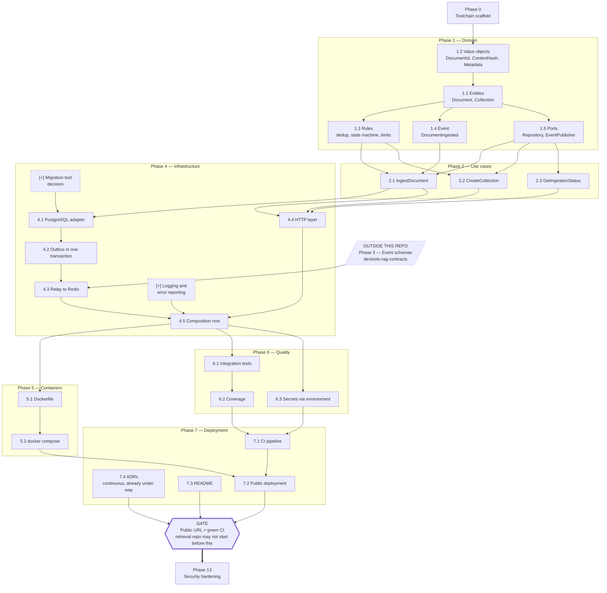

# Build Plan — What to Build Here, In What Order, and What Can Run in Parallel

> **What this file is for.** `docs/ROADMAP.md` lists the units of work for this
> repository as an ordered table. It does not show which units actually *block*
> which, so everything reads as one long chain and the opportunities to work on
> two things at once are invisible. This file shows the dependencies.
>
> **Scope: this repository only.** Two nodes from outside appear because work
> here genuinely stops without them; both are drawn as external and named as
> such. Nothing else about the contracts or retrieval repositories is here.
>
> **This file is living.** When work appears that this analysis missed, it is
> added here rather than tracked somewhere else. Items added after the original
> roadmap are marked `[+]` and listed in
> [Work added to the plan](#work-added-to-the-plan).

---

## The map

### How to read it

| Marking | Meaning |
|---|---|
| Solid arrow `→` | The task at the tail **must finish** before the one at the head starts |
| Slanted box | Work in another repository that blocks work here |
| Six-sided box | A gate: a checkpoint, not a task |
| `[+]` and a dashed border | Work this plan added; not in the original roadmap |
| Box grouping | The roadmap phase the unit belongs to |

Anything with **no arrow between it** can be worked on at the same time.

---

## What can be done in parallel

| These can run at the same time | Why they do not block each other |
|---|---|
| **1.3 rules**, **1.4 event** and **1.5 ports** | All three need the entities and nothing from each other. Three independent lines of work as soon as 1.1 lands. |
| **2.1**, **2.2** and **2.3** | The three use cases share the ports but never call each other. |
| **4.4 HTTP layer** and **4.1 → 4.2 → 4.3** | The web layer talks only to the use cases; the storage chain only to the database. They meet for the first time at 4.5. This is the longest parallel stretch in the repository. |
| **Phase 5 containers** and **Phase 6 quality** | The integration tests start their own throwaway containers; they do not need the production image to exist. |
| **7.3 README** and **7.4 ADRs** and **everything** | Neither depends on code. 7.4 is already under way — five ADRs are written. |
| **`[+]` migration tool** and **`[+]` logging** and **Phases 1–2** | Both are decisions, not code. Making them while the domain is being written costs nothing and unblocks Phase 4 the moment it starts. |

## What blocks the most

| Unit | Why it is the bottleneck |
|---|---|
| **1.1 Entities** | Three units wait on it directly, and everything else transitively. The single highest-leverage piece of work in the repository. |
| **2.1 IngestDocument** | Both halves of Phase 4 wait on it — the storage chain and the HTTP layer. |
| **4.5 Composition root** | Everything downstream — containers, quality, deployment — waits here. |
| **4.2 Outbox in one transaction** | Not the most-blocking, but the least forgiving. Getting it wrong is a defect no amount of downstream work compensates for. |

## Two notes on the edges

**The event travels in both directions.** Unit 1.4 settles the *shape* of the
`DocumentIngested` announcement here, before Phase 3 turns it into the shared
schema in the contracts repository; Phase 4.3 then depends on that schema coming
back. The diagram draws only the blocking half of that loop — 1.4 is not a
prerequisite for starting anything here, so an arrow would suggest a wait that
does not exist. `ROADMAP.md` 1.4 records the other half: "shape agreed before
Phase 3".

**`ROADMAP.md` numbers entities as 1.1 and value objects as 1.2**, but the
dependency runs the other way: a `Document` holds a `DocumentId` and a
`ContentHash`, so the value objects come first. The numbering is a listing
order, not a build order. The map above follows the dependency.

---

## What each box means, in plain language

**Phase 0 — Toolchain scaffold.** Set up the workshop before making anything. This means installing the tools that check the work — one that catches sloppy writing, one that catches mistakes about what kind of thing each value is, one that runs the tests — and proving all three run and pass on an empty project. It goes first because these tools are painless to adopt when there is nothing to fix and painful to adopt once there is.

**1.2 — Value objects.** Define the small, precise things a document is described by: its identifier, a fingerprint of its contents, and the labels attached to it — which library it documents, which version, what kind of page it is, where it came from. The point is that an invalid one cannot be created at all: there is no such thing as a half-formed fingerprint sitting around waiting to cause trouble later.

**1.1 — Entities.** Define what a document and a collection actually *are*, built out of the pieces from 1.2. A document is a thing with an identity that persists as its contents and status change; a collection is the box documents go into. This is the vocabulary everything else is written in.

**1.3 — Rules.** Write down the things that must always be true. The same document cannot be stored twice in the same box. A document moves through its stages in one direction only — waiting, being worked on, then either finished or failed — and never jumps backwards. Nothing may exceed the agreed size or count. Each rule gets a test proving it cannot be broken.

**1.4 — Event.** Define the announcement the service makes when a document has been accepted: what it says and what it carries. Its shape is settled here, before anything sends it, because the rest of the system will be built around that shape.

**1.5 — Ports.** Describe the *shape of the sockets* the outside world plugs into: something that can store and retrieve documents, and something that can publish announcements. Only the shape — no database, no message channel. This is what lets everything above be tested and built before any real machinery exists.

**2.1 — Ingest a document.** The main thing this service does: take a document that has arrived, check it against the rules, store it, and announce it. At this stage it runs against pretend storage that lives only in memory, which proves the recipe is right before real machinery exists.

**2.2 — Create a collection.** Make a new box for documents to go into.

**2.3 — Report ingestion status.** Answer the question "what happened to the document I sent?"

**[+] Migration tool decision.** Decide how changes to the database's shape get applied — adding a column, creating a table — in a way that is repeatable and reversible on every machine and in production. Deciding before the first table exists is far easier than retrofitting around tables already full of data.

**4.1 — PostgreSQL adapter.** Build the piece that actually writes documents into a real database and reads them back. It plugs into the socket defined in 1.5, so the recipes from Phase 2 do not change at all — they simply stop talking to pretend storage and start talking to the real thing.

**4.2 — Outbox in one transaction.** The centrepiece. When a document arrives, two things must be recorded: the document itself, and a note saying "tell the rest of the system about this". Both are written in a single all-or-nothing step, so it is impossible to end up having stored a document nobody was ever told about — even if the machine loses power in between.

**4.3 — Relay to Redis.** A separate, independently running program whose only job is to read those notes, announce them, and mark them as sent. Because it is separate, the part that accepts documents keeps working even when the announcement channel is down; the notes simply pile up and go out later.

**4.4 — HTTP layer.** The front door. This is what turns "a program with some recipes" into something you can send a document to over the internet, and it publishes its own instruction manual automatically, so anyone can see what it accepts without asking.

**[+] Logging and error reporting.** Decide how the service says what it is doing and shouts when something breaks. This matters most for the relay, which runs unattended: without it, a relay that has quietly stopped announcing anything looks exactly like a relay with nothing to announce.

**4.5 — Composition root.** One single place where all the real pieces are plugged into all the sockets. Having exactly one such place is what makes it possible to swap any piece — a different database, a different message channel — by editing one file instead of hunting through the whole codebase.

**5.1 — Dockerfile.** Package the service so it runs identically on any machine, regardless of what is installed there.

**5.2 — docker compose.** One command that starts everything a developer needs — the service, the relay, the database, the message channel — on a computer that has none of them.

**6.1 — Integration tests.** Prove the whole thing works against real software rather than stand-ins: a genuine database and message channel, started fresh for the tests and thrown away afterwards.

**6.2 — Coverage.** Measure how much of the code the tests actually exercise, and report it automatically so the number cannot quietly drift.

**6.3 — Secrets via environment.** Make sure no password, key or connection string is written down anywhere in the repository, and provide an example file showing which ones a deployment needs to supply.

**7.1 — CI pipeline.** Set up a robot that runs every check on every proposed change, so nothing broken can be merged by accident or optimism.

**7.2 — Public deployment.** Put the service on the internet at an address anyone can send a document to.

**7.3 — README.** Write the explanation someone reads cold, having never seen the repository, and comes away understanding what it does and why it is built this way.

**7.4 — ADRs.** Record every non-obvious decision with the alternatives that were rejected and what the choice costs. Already under way — five are written.

**GATE.** A public address that accepts documents, with all checks green. **The retrieval repository is not created until this is true.** The rule exists because two half-finished services are worth less than one finished one.

**Phase 13 — Security hardening.** Limit how fast anyone can hammer the service, check everything arriving from outside, and audit every secret. It comes last because hardening a system whose shape is still changing means doing it twice.

---

## Work added to the plan

Two items the roadmap did not name. Neither is large; both are cheap now and awkward later.

| Item | Why it is missing-work rather than scope creep | When it is needed |
|---|---|---|
| **Migration tool decision** | The roadmap says the database schema changes but names no mechanism for applying those changes repeatably across machines and production. | Before 4.1 |
| **Logging and error reporting** | Neither `ROADMAP.md` nor `ARCHITECTURE.md` gives this service an observability story. The relay runs unattended, where silence and success look identical. | Before 4.5 |

Two further gaps belong to the other repositories and are recorded here only so they are not lost: the **contracts repository needs its own toolchain scaffold** before Phase 3, and **somebody has to actually collect the corpus** — the roadmap chose what it is but never scheduled gathering it, and the retrieval repository's evaluation phase cannot happen without it.

To add another item later: put it in the diagram with a `[+]` prefix and a dashed border, add its arrows, write its plain-language paragraph above, and add a row to this table.
